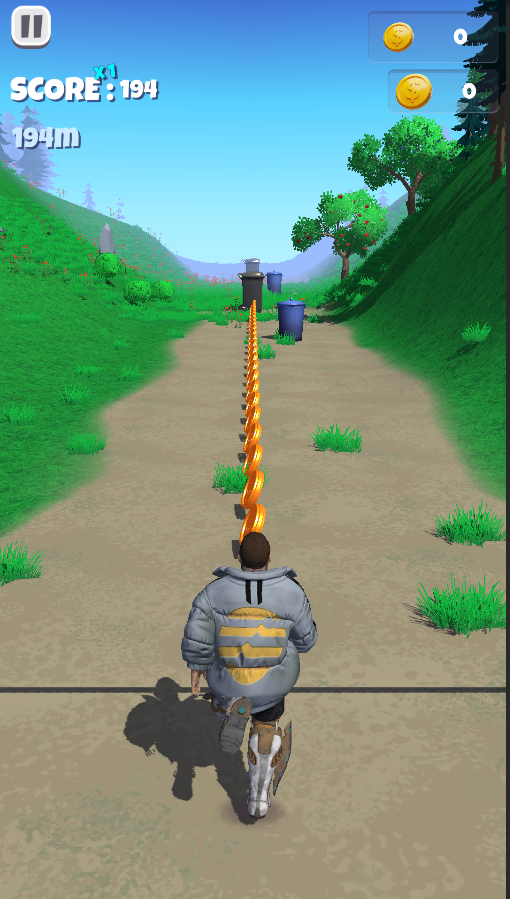
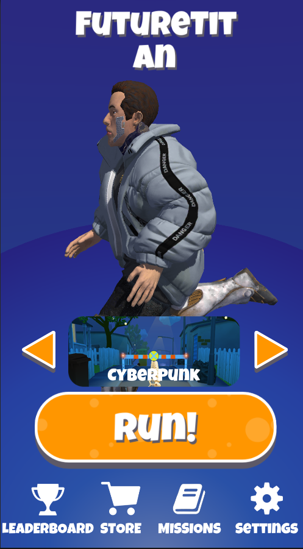

# Aptos Victors

## Table of Contents

- [Introduction](#introduction)
- [Gameplay](#gameplay)
- [Installation](#installation)
- [Features](#features)
- [Updates](#updates)
- [Media](#media)
- [New Environments](#new-environments)
- [Links](#links)
- [Support](#support)

## Introduction

Welcome to **Aptos Victors**, the ultimate multiplayer online game where strategy, skill, and teamwork lead you to victory. Dive into intense battles and experience the thrill of conquering challenges with your team.

## Gameplay

Step into the future of gaming with Aptos Victors – an immersive, AR-powered endless runner that blends cutting-edge technology with thrilling gameplay.

Experience a world where reality and gaming collide, as you collect, trade, and compete with unique NFTs.

## Installation

1. Visit our landing page at [aptosvictors.xyz](https://aptosvictors.xyz).
2. Sign up to join our waitlist to be notified about the game release.

## Features

- **Multiplayer Battles**: Join forces with friends or players worldwide.
- **Strategic Gameplay**: Use strategy and tactics to outsmart your opponents.
- **User-Friendly Dashboard**: Manage your account and game settings effortlessly.

## Updates

### Version 0.1
    - Start Building the Core Game Components with Aptos Unity SDKs

### Version 0.2

- **Login and Dashboard Update**: We've streamlined the login process and enhanced the dashboard for a more intuitive user experience.
  - Introducing Google and social media login icons for a smoother authentication flow.
- **Updated URLs**:
  - Landing Page: [https://aptosvictors.xyz](https://aptosvictors.xyz)
  - Dashboard: [https://dashboard.aptosvictors.xyz](https://dashboard.aptosvictors.xyz)
- **AR Pass Integration**: Access special content through [pass.aptosvictors.xyz](https://pass.aptosvictors.xyz).
- **Building Gameplay Enhancements**: The latest update focuses on improving game-building mechanics.

### Version 0.2.1

   - New 3D Models: Introduction of high-quality 3D models to enhance the visual experience.
- Website Update: A complete overhaul of the aptosvictors.xyz website to improve navigation and user experience.
        - Featuring new sections for gameplay tips, developer blogs, and community forums.

## Media

### V1 Gameplay Video
Watch the Version 1 gameplay experience right here:

[V1 Gameplay Video](./Images/v1.mp4)

### Version 2 Teaser
Check out what's coming in Version 2:

[Version 2 Teaser](./Images/v2.mp4)

Aptos Victors will be Moving to a new repository with this update, and all technical updates and issues will be handled there.

### AR Pass Feature
Explore the AR pass feature:

[AR Pass Video](./Images/pass.webm)

## New Environments

We are excited to introduce two new environments in Aptos Victors:

- **Nature Environment**
- **City Environment**

See the environments below:

  

    
    
Nature Environment

  

  

    
    
City Environment

  

## New Home Page

Check out our new home page design:

## Links

- **Landing Page**: [aptosvictors.xyz](https://aptosvictors.xyz)
- **Dashboard**: [dashboard.aptosvictors.xyz](https://dashboard.aptosvictors.xyz)
- **AR Pass**: [pass.aptosvictors.xyz](https://pass.aptosvictors.xyz)

## Support

For any issues or support, please contact our support team at support@aptosvictors.xyz or visit our [Support Page](https://support.aptosvictors.xyz).

---

Thank you for being a part of the Aptos Victors community. We look forward to seeing you in the game!
